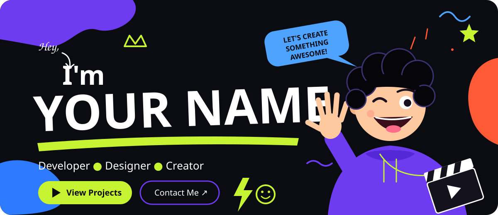
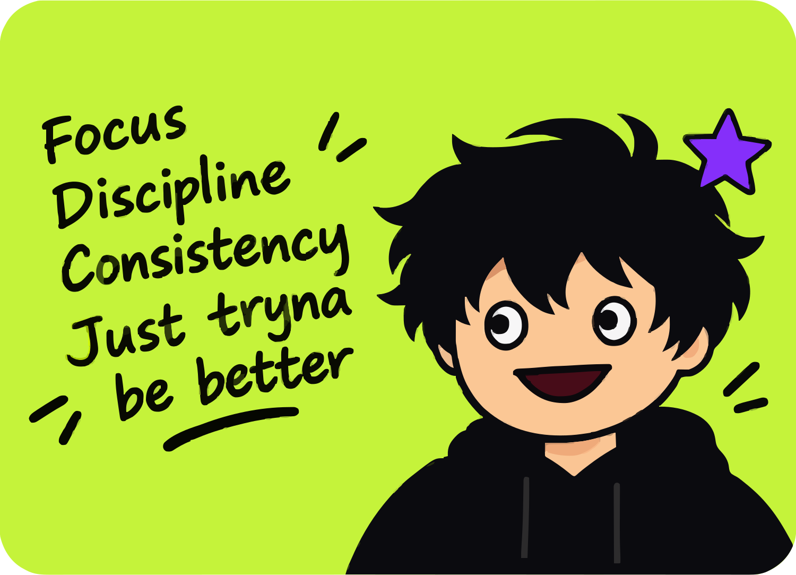
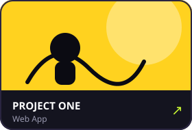
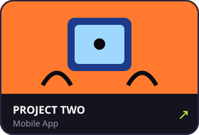
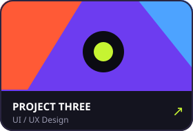
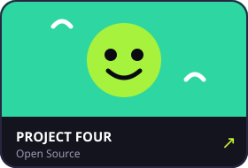
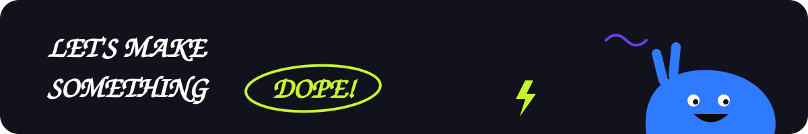

 

## ✦ About Me

<table>
  <tr>
    <td width="42%" align="center">
      
    </td>
    <td width="58%">
      

        Hi, I'm <b>YOUR NAME</b> — a <b>Developer & Designer</b> who loves turning ideas
        into playful, impactful visuals and products. I enjoy telling stories that
        entertain, connect, and leave a lasting impression.
      

      <ul>
        <li>🎯 Currently working on <b>your current project</b></li>
        <li>🌱 Currently learning <b>your learning topic</b></li>
        <li>🤝 Open for <b>collaboration & freelance</b></li>
        <li>⚡ Fun fact: <b>write a fun fact here</b></li>
      </ul>
    </td>
  </tr>
</table>

## ✦ Skills

**🎨 Creative Tools**

**💻 Tech Stack**

**🧰 Tools**

## ✦ Featured Projects

<table>
  <tr>
    <td></td>
    <td></td>
    <td></td>
    <td></td>
  </tr>
</table>

<a href="https://github.com/Reezxyz?tab=repositories"><b>View all projects →</b></a>

## ✦ GitHub Stats

 

## ✦ Get in Touch

  

📧 hello@yourmail.com &nbsp;•&nbsp; 📍 Indonesia

Made with 💜 and a lot of ☕

